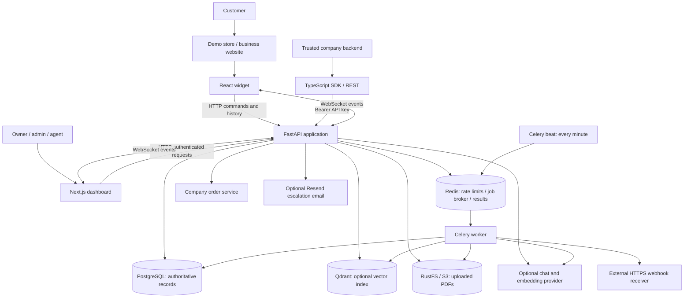
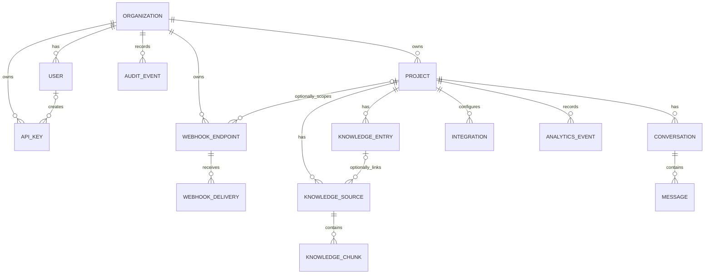
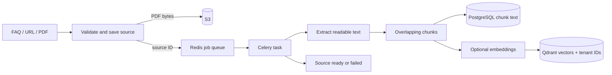
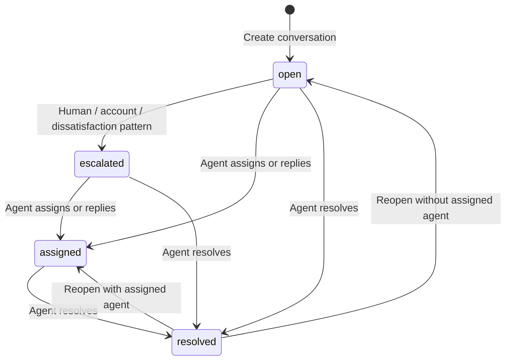

# OpenSupport architecture and interview study guide

This guide describes the checked-out code, including local changes, as reviewed on 3 October 2026. It explains implemented behavior rather than treating older portfolio descriptions as guarantees. Read sections 1–5 first, then trace the flows with the source open. No guide can predict every interview question; the goal is to understand the code well enough to reason about new questions.

## 1. Explain the project in 30 seconds

> OpenSupport is a self-hosted customer support platform. A business creates an organization and support projects, adds approved help content, and embeds a React chat widget on its website. A FastAPI backend persists conversations, retrieves project-specific knowledge, optionally asks a language model to write a grounded answer, and hands selected conversations to agents. A Next.js dashboard provides setup and the agent inbox. Celery handles knowledge ingestion and webhook delivery, with PostgreSQL for application records, Redis for jobs and rate limits, Qdrant for optional vector search, and S3-compatible storage for PDFs.

The core engineering problem is connecting public customer chat to private organization data while coordinating AI responses, human replies, background jobs, and external integrations.

## 2. Overall architecture



Think of this as a **modular backend with a separate background worker**, in a **monorepo**. A monorepo means multiple applications and packages share one repository. It does not imply microservices. The Python API and worker share the same models and service code; there is no separately deployed service for each business feature.

### What each infrastructure component stores

| Component | Actual responsibility | Why it exists |
|---|---|---|
| PostgreSQL | Users, organizations, projects, knowledge text, conversations, messages, integrations, audits, webhook records | Durable relationships, transactions, ownership queries |
| Redis | Celery broker and result backend; short-lived rate-limit counters | Queue work and count requests across API processes |
| Qdrant | Embedding vectors and chunk/tenant IDs | Retrieve semantically similar knowledge when embeddings are configured |
| RustFS / S3 | Original uploaded PDF bytes | Keep files outside relational rows and let workers retrieve them |
| API process memory | Connected WebSockets and agent presence | Immediate event fanout inside one API process |
| Browser localStorage | Dashboard tokens; widget conversation ID per project | Persist login and chat continuity across reloads |

Redis is **not currently a general response cache or the WebSocket event bus**. Qdrant is **not the canonical store for chunk text**. PostgreSQL remains authoritative.

## 3. Every source folder and important file

Generated directories such as `node_modules`, `.next`, `dist`, `.venv`, `__pycache__`, and tool caches hold dependencies/build output, not the project's business logic. `.git` holds repository history. `.gitkeep` only keeps an otherwise empty folder tracked.

```text
opensupport/
├── apps/                    Browser applications
│   ├── dashboard/           Private workspace and agent UI (Next.js)
│   │   └── app/             App Router pages, components, API helper, styles
│   ├── widget/              Reusable customer chat component (React + Vite)
│   │   └── src/             Widget implementation, preview, styles
│   └── demo-store/          Example storefront consuming the widget (Next.js)
│       └── app/             Storefront page, layout, styles
├── packages/                Reusable TypeScript workspace packages
│   ├── sdk/src/             Small server-side REST client
│   ├── shared-types/src/    Shared TypeScript interfaces
│   └── ui/                  Placeholder package; no component library yet
├── backend/
│   ├── app/
│   │   ├── api/             HTTP route handlers
│   │   ├── core/            Configuration and security helpers
│   │   ├── db/              Async SQLAlchemy engine/session
│   │   ├── services/        Retrieval, ingestion, integrations, delivery helpers
│   │   ├── workers/         Celery setup and task wrappers
│   │   ├── websocket/       In-memory event fanout and presence
│   │   ├── middleware/      Redis request rate limiting
│   │   ├── repositories/    Empty placeholder; no repository layer implemented
│   │   ├── models/          Empty placeholder; models actually live in models.py
│   │   ├── schemas/         Empty placeholder; schemas actually live in schemas.py
│   │   ├── main.py          Application composition and WebSocket endpoints
│   │   ├── models.py        Database tables and ORM relationships
│   │   └── schemas.py       Request/response validation contracts
│   ├── alembic/             Database migration environment
│   │   └── versions/        Initial schema/adoption migration
│   ├── tests/               Security, schema, and mocked chat-flow tests
│   └── Dockerfile           Python worker image
├── docs/                    Setup, operations, developer API, study guides
├── docker/                  Empty placeholder; Compose is at repository root
└── .github/workflows/       CI workflow
```

### Frontend code map

| File | What to understand |
|---|---|
| `apps/dashboard/app/layout.tsx` | Next.js root page shell and global style loading |
| `apps/dashboard/app/page.tsx` | Client state, selected project, view switching; project/domain configuration; FAQ, URL and PDF forms; source refresh |
| `apps/dashboard/app/AuthPanel.tsx` | Register/login form, token persistence, notify parent of authentication |
| `apps/dashboard/app/api.ts` | Adds Bearer token, refreshes after eligible 401 responses, retries once; shares one refresh Promise between concurrent requests |
| `apps/dashboard/app/Inbox.tsx` | Conversation list/filter/search, selected transcript, assignment/reply/resolve/reopen actions; presence and conversation WebSockets |
| `apps/dashboard/app/DeveloperSettings.tsx` | Developer administration UI; read it alongside API-key, webhook, integration, analytics and organization endpoints |
| `apps/dashboard/app/style.css` | Dashboard appearance, not authorization or business rules |
| `apps/widget/src/index.tsx` | `ChatWidget`, history loading, POST message flow, status, WebSocket reconnect, deduplication, new conversation and mounting API |
| `apps/widget/src/playground.tsx` | Standalone development preview with project selection |
| `apps/widget/src/widget.css` | Widget appearance and message presentation |
| `apps/widget/vite.config.ts` | Builds ES and UMD library formats; React/ReactDOM are external dependencies |
| `apps/widget/index.html` | HTML entry point for the Vite preview |
| `apps/demo-store/app/page.tsx` | Static mock storefront, launcher toggle, imports and renders `ChatWidget`; no real shopping/checkout backend |
| `apps/demo-store/app/layout.tsx` and `style.css` | Store shell and appearance |
| `packages/sdk/src/index.ts` | `OpenSupportClient`: list projects, list conversations/messages, reply; configurable fetch for testing/integration |
| `packages/shared-types/src/index.ts` | Project, Conversation, Message, status, error interfaces; used by SDK |

The dashboard and widget mostly define their own local types. Shared TypeScript interfaces are not generated from Pydantic and do not enforce runtime response validation. The SDK covers a subset of the API. Its reply payload includes `agent_name`, but the backend derives the actual sender from the authenticated account.

### Backend code map

| File | What it does |
|---|---|
| `app/main.py` | Creates FastAPI app, adds CORS/rate limits, registers routers, health check, startup/shutdown, two WebSocket endpoints |
| `app/api/auth.py` | Register/login/refresh/logout/me; members; API key creation/list/revocation; retention settings/prune; organization export |
| `app/api/routes.py` | Projects, knowledge/sources, integrations, webhooks/logs/retry, widget chat/order lookup, analytics/audit, agent inbox/actions |
| `app/models.py` | SQLAlchemy classes mapped to PostgreSQL tables, indexes, foreign keys, defaults, relationships |
| `app/schemas.py` | Pydantic input/output classes, lengths/constraints, allowed-host normalization, response serialization |
| `app/core/config.py` | Loads environment settings; validates key strength in production; defines dependency URLs and optional provider settings |
| `app/core/security.py` | PBKDF2 passwords, HMAC-signed access/refresh tokens, widget identity, API key lookup, current-user and role dependencies |
| `app/db/session.py` | Async database engine and session factory; `get_session` yields a request session |
| `app/middleware/rate_limit.py` | IP-based Redis counters for widget and credential routes; 429 over limit; Redis failure behavior depends on environment |
| `app/services/assistant.py` | Greeting replies, FAQ word matching, chunk retrieval, context assembly, optional model call, saved-content fallback |
| `app/services/providers.py` | `ChatProvider` Protocol; compatible HTTP implementation; external factories through Python entry points |
| `app/services/vector_store.py` | Embedding batches, collection setup/dimension checks, upsert/search/delete vectors; scoped SQL fallback |
| `app/services/ingestion.py` | Public URL checks, HTML/PDF/text extraction, overlapping chunks, source state, replacement/indexing |
| `app/services/storage.py` | S3 upload/read/delete via boto3; blocking work moved to threads |
| `app/services/encryption.py` | AES-GCM encryption/decryption for recoverable integration/webhook secrets |
| `app/services/webhooks.py` | Match subscriptions, persist delivery records, enqueue Celery jobs |
| `app/services/webhook_delivery.py` | Lock delivery, validate HTTPS target, sign bytes, send, record attempts/result/retry window |
| `app/services/notifications.py` | Optional escalation email through Resend; FastAPI background task |
| `app/workers/celery_app.py` | Redis broker/results, JSON tasks, late acknowledgement, prefetch 1, minute-based webhook sweep |
| `app/workers/tasks.py` | Ingestion/delivery task wrappers with retries; recovery sweep for due deliveries |
| `app/websocket/manager.py` | `hub`, channel connection sets, locking, fanout, presence, conversation events |
| `alembic/env.py` / `alembic.ini` | Migration connection and model metadata setup |
| `alembic/versions/0001_adopt_and_create_schema.py` | Creates missing tables and adopts legacy schema; intentionally irreversible downgrade |
| `tests/test_core_security.py` | Password verification, token type/tamper checks, project-bound widget identity |
| `tests/test_schemas.py` | Host normalization/rejection and webhook event validation |
| `tests/test_chat_replies.py` | Mocked assistant/handoff behavior, provider failure fallback, legacy recovery |

Route handlers contain SQL directly. This is not a fully separated controller/service/repository architecture. Explain the layering that exists, and propose further separation as an improvement.

### Root and build files

| File | Responsibility |
|---|---|
| `README.md` | Entry point and local setup |
| `CONTRIBUTING.md` | Contributor workflow and checks |
| `.env.example` | Template for backend configuration; `.env` contains local values |
| `pyproject.toml` | Python dependencies, dev dependencies, pytest and Ruff configuration |
| `requirements-dev.txt` | Alternative pip installation requirements |
| `package.json` | Root workspace scripts and pinned pnpm version |
| `pnpm-workspace.yaml` | Defines workspace applications/packages |
| `pnpm-lock.yaml` | Locked pnpm dependency graph |
| `package-lock.json` | npm lock artifact also present; documented workspace workflow uses pnpm |
| `turbo.json` | Task orchestration configuration for the monorepo |
| `docker-compose.yml` | PostgreSQL, Redis, Qdrant, RustFS and optional worker; named volumes |
| `start-dev.ps1` | Local startup helper; pair with the step-by-step runbook |
| `.github/workflows/ci.yml` | Automated project checks |
| `.gitignore` | Excludes generated/local artifacts from version control |

Each app/package `package.json` defines its dependencies and scripts. `tsconfig.json` configures TypeScript checking; `next.config.ts` configures the Next.js app where present; `next-env.d.ts` supplies Next.js type declarations. `__init__.py` marks Python packages. Alembic's `script.py.mako` is a migration template.

## 4. Data model: follow ownership



This diagram shows primary relationships, not every foreign key. Chunks also store project and organization IDs; audit records can reference actors; webhook endpoints can reference their creator.

| Entity | Meaning / key fields |
|---|---|
| Organization | Business workspace; `retention_days` |
| User | Staff account; organization, globally unique email, password hash, role, active flag, token version |
| Project | Support setup for a site/product; organization, name, exact allowed hosts |
| KnowledgeEntry | Manually approved FAQ text; title and content |
| KnowledgeSource | Ingestion metadata; text/URL/PDF kind, URL or file key or entry reference, status/error/index timestamp |
| KnowledgeChunk | Extracted text fragment; source/project/organization IDs, order index, content |
| Conversation | Chat session; project, status, assigned agent name, escalation/resolution data, optional verified visitor |
| Message | Transcript item; sender type/name, text, optional source title, timestamp |
| APIKey | Hash/prefix of external credential, creator, expiry, revocation, last use |
| Integration | Project-specific company API URL and encrypted token |
| WebhookEndpoint | Subscription URL, events, optional project, encrypted signing secret, enabled flag |
| WebhookDelivery | One delivery attempt lifecycle; stable ID, payload, status, attempts, response/error, next retry |
| AuditEvent | Who performed an administrative/action event and its target/details |
| AnalyticsEvent | Product event and dimensions; current overview also calculates counts from conversation/message tables |

Ownership chain: **message → conversation → project → organization**. Authenticated conversation access joins through Project and compares its organization to the logged-in user's organization. Chunk search filters organization and project in Qdrant, then checks them again in PostgreSQL.

Foreign keys preserve references and many use `ON DELETE CASCADE`. ORM relationships also define selected cascades. Indexes support ownership/reference lookups. UUIDs identify records but are not a substitute for access checks. Assignment is currently a display-name string, not an agent-user foreign key; duplicate/changed names are a design limitation.

## 5. Customer message: the most important trace

Example: the approved FAQ says “Returns are allowed within 30 days.” The visitor asks “What is your return policy?”

```mermaid
sequenceDiagram
    participant W as Widget
    participant A as FastAPI routes
    participant D as PostgreSQL
    participant R as Assistant / retrieval
    participant L as Optional model
    W->>A: POST /api/widget/{project}/conversations
    A->>A: Validate Origin and optional signed identity
    A->>D: Commit conversation
    A-->>W: Conversation ID
    W->>A: Open conversation WebSocket
    W->>A: POST conversation messages, content
    A->>A: Check Origin, status, escalation patterns
    A->>D: Add customer message; flush
    A->>R: answer_question(session, conversation, question)
    R->>D: Read project FAQs and scoped chunks
    opt Relevant content and chat provider configured
        R->>L: System instruction + content + current question
        L-->>R: Completed answer
    end
    R-->>A: Answer text and source title
    A->>D: Commit customer and assistant messages
    A-->>W: WebSocket message events
    A-->>W: HTTP array of created messages
```

Trace these functions in order:

1. `ChatWidget` initialization restores a per-project conversation ID from localStorage or creates a conversation. It loads transcript/status and connects its WebSocket.
2. The widget's `send` POSTs `{content}`. It shows an activity state while awaiting the HTTP response.
3. Middleware applies the public IP rate limit. Pydantic validates the body; `get_session` supplies an async SQLAlchemy session.
4. `routes.send_message` loads the conversation/project, checks Origin, rejects resolved conversations with 409, and adds/flushed the customer message.
5. For an already assigned/escalated human conversation it commits just the customer message and returns. The assistant does not take over. A specific legacy automatic-handoff case can return to `open` when no agent is assigned.
6. For an open conversation it checks escalation patterns. Otherwise it calls `assistant.answer_question`.
7. The assistant handles greetings/thanks without retrieval. For substantive questions it tokenizes/normalizes terms, removes common words, ranks FAQs by word overlap, and retrieves chunks.
8. Chunk retrieval optionally embeds the query and searches Qdrant using cosine similarity, a 0.32 threshold, and tenant filters. If no usable vector results are obtained, SQL lexical ranking is available. The assistant additionally requires word overlap for the returned chunks.
9. No relevant content produces a clarification/support-agent suggestion, with no citation. Relevant content supplies a FAQ and up to four chunks, deduplicated into context.
10. A configured chat provider receives only system instruction, retrieved content and the current question. Without a provider, or for handled completion HTTP/value errors, the answer returns saved content, truncated to 3,000 context characters.
11. The route persists the reply, commits, refreshes messages, publishes events, and attempts to persist/enqueue matching webhooks. It returns created messages as JSON.
12. The widget deduplicates by message ID because HTTP and WebSocket can both deliver the same record. It also reloads conversation status after sending.

**Interview precision:** this is not token streaming. The model completes inside the HTTP request; WebSockets carry completed messages and status/presence events. There is no full transcript included in the current model prompt, no model training/fine-tuning, and no autonomous tool selection in this flow.

`flush()` sends pending SQL and populates IDs within the transaction. `commit()` makes the transaction durable. `refresh()` reloads saved values. Keeping the customer message uncommitted during model completion means the database transaction can stay open during slow external work; moving generation to a job would change latency and durability behavior.

## 6. Knowledge ingestion: a separate pipeline



- FAQ creation saves both `KnowledgeEntry` and a linked text source. The assistant can search the entry directly even before chunk ingestion finishes. Queue failure marks that source failed while retaining the FAQ.
- URL ingestion handles one HTML page, not a recursive website crawl. It checks public addresses, disables redirects, limits response bytes, and excludes script/style-like text during extraction.
- PDF upload stores original bytes in S3; workers use pypdf text extraction. There is no OCR pipeline for scanned image-only PDFs.
- `_chunks` uses about 1,400 characters with 180-character overlap, splitting on a nearby word boundary. These are character limits, not token limits. Overlap helps preserve meaning across boundaries.
- Source states are `pending → processing → ready`, or `failed` with an error. Refresh rebuilds new chunks before deleting the old set.
- `index_chunks` embeds batches of up to 48 and creates/checks a cosine collection. No embedding configuration returns false, but SQL chunks can still become ready for lexical retrieval.
- New vector writes and SQL updates are not one distributed transaction. Stale/orphan vectors can occur; SQL validation rejects IDs without matching chunk records.
- Celery task wrappers retry selected network/connection failures. Bad input/parsing errors need correction or manual refresh. Source ingestion does not have the same periodic persisted-job recovery mechanism as webhook delivery.

Embeddings convert text to numeric vectors so related meanings can be nearby. Generation uses retrieved text to compose a response. Configuring a chat model alone does not enable embeddings: `EMBEDDING_MODEL` and a compatible embeddings endpoint are also required.

## 7. Human handoff and conversation state



Current `_escalation_reason` rules are regex patterns:

| Input example | Reason |
|---|---|
| “I want to speak to a human” | `customer_requested_human` |
| “Where is my order?” | `account_specific_request` |
| “That did not help” | `repeated_unsuccessful_attempts` |

The third name does not mean an attempt counter exists: a matching phrase triggers it. “Someone” and other broad patterns can produce false positives.

Escalation saves a system handoff message, sets reason/time/status, publishes to the conversation channel and organization agent channel, emits a webhook, and schedules optional email. The inbox lists active conversations; a logged-in agent claims or replies. Sender name comes from their account. Reply sets `assigned`; resolve records a timestamp and prevents further customer/agent replies until reopened.

Missing knowledge and handled provider failures currently **do not automatically escalate**. Older documentation describing this behavior is stale. Unknown questions invite clarification; completion failures can return saved support content; handled retrieval HTTP failures ask the customer to retry or request an agent.

## 8. Authentication, permissions and visitor identity

### Dashboard login lifecycle

1. Register creates an organization and owner account (and can adopt legacy starter projects).
2. Passwords use salted PBKDF2-HMAC-SHA256 with 310,000 iterations; comparisons use a constant-time helper.
3. Login returns signed HS256 JWT-style access and refresh tokens: `sub`, `ver`, `typ`, `iat`, `exp`.
4. Current defaults are 20-minute access and 14-day refresh lifetimes. Browser API helper stores both tokens and refreshes after an eligible 401.
5. Backend checks signature/type/expiry, active user and database token version. Logout increments the version, revoking existing account tokens, not just one browser session.
6. Role dependencies restrict operations: owners/admins configure projects and developer settings; owners/admins/agents use inbox; export/prune are owner-only.

Authentication answers “who are you?” Authorization answers “may you do this?” Tenant scoping answers “which organization's records may you access?” All three matter.

### API keys versus encrypted secrets

API keys are high-entropy `osk_live_...` credentials, shown on creation and stored as SHA-256 hashes. Lookup checks revocation/expiry and active creator; permissions inherit that user's current role. They are for trusted backends, never browser bundles.

Integration tokens and webhook secrets must be recoverable for outbound requests/signing, so they use AES-GCM encryption with random nonces. Passwords and API keys need verification, not recovery, so hashing is appropriate. Base64 in signed tokens is encoding, not encryption.

### Public widget boundary

Widget requests require an exact allowed host, including port. HTTPS is required except local HTTP hosts. Browser CORS is configured broadly in `main.py`; explicit widget Origin checks enforce the per-project host rule. The parsed `cors_origins` setting is not currently used by that middleware setup.

Origin checking is not visitor ownership authentication. Requests carrying a conversation UUID and an accepted Origin can access that conversation; nonbrowser clients can supply Origin themselves. A stronger production design would issue a separate conversation credential and verify it on HTTP and WebSocket operations.

Optional widget identity is a short-lived signed project/visitor token produced by a trusted backend. It binds a visitor to the conversation on creation. It is required for order lookup, but is not revalidated on every transcript request. The widget reuses its stored conversation ID; changing identity props does not automatically replace an existing conversation with a newly verified one.

### Order tool

`POST /api/widget/conversations/{id}/tools/order-status` requires verified visitor identity and an enabled integration. It requests an escaped order ID from the company's service with the decrypted Bearer token and `X-Verified-Customer-ID`, returning only allowlisted fields. The company service must enforce that customer's ownership of the order. This endpoint exists separately; the assistant does not automatically invoke it and the standard widget has no order-tool flow.

## 9. Webhooks and delivery reliability

Supported subscription events: `conversation.created`, `message.created`, `conversation.escalated`, `conversation.resolved`.

1. A business operation commits its data.
2. `_emit_webhook_safely` matches organization/project subscriptions and tries to persist delivery rows.
3. `emit_webhook_event` commits delivery rows before enqueueing Celery jobs. Queue failure is logged; saved jobs remain recoverable.
4. Worker locks a delivery, checks final/retry states, validates HTTPS/public target, increments attempts, sets a retry lease and commits.
5. It serializes a stable JSON body, signs the exact bytes with HMAC-SHA256, and sends signature/event/delivery headers.
6. Success becomes `delivered`. Failure becomes `pending` or `failed` after the attempt limit; retry intervals grow exponentially and are bounded.
7. Celery beat schedules a minute-based database sweep that requeues saved due deliveries. Manual retry is also available.

The receiver should verify the signature over raw bytes and deduplicate by stable delivery ID. A network timeout after the receiver accepts a POST can cause another attempt, so do not promise exactly-once delivery.

This is a persisted outbox-like mechanism, with an important gap: the business record and webhook delivery are committed separately. Failure between those commits can lose an event. A transactional outbox would save the business change and event in one transaction, then dispatch independently.

Notifications differ: Resend email uses FastAPI `BackgroundTasks` in the API process and is optional/best effort. It does not have Celery's durable queue or delivery history.

## 10. Runtime, async code and deployment

Typical local processes: API at 8000, dashboard at 3000, Vite widget at 5173, optional demo store at 3002, Celery worker and beat, plus Compose infrastructure. Compose currently includes an optional worker, not a complete API/dashboard production deployment.

`async def` lets the API await database/network I/O without blocking the entire event loop. It does not make CPU-heavy work free. boto3 operations and queue dispatch are sent to threads; ingestion is moved to worker processes. Worker tasks use synchronous Celery wrappers around `asyncio.run` and create/dispose their own async DB engines.

Development startup creates absent tables and applies additive legacy upgrades. Production skips this bootstrap and should run Alembic migrations. The initial migration imports current model metadata, a convenient adoption strategy but less stable than explicit frozen schema migrations for long-term production history.

`/health` checks PostgreSQL and Redis. It does not verify Qdrant, object storage, model availability, worker activity or end-to-end chat. Compose volumes preserve state across ordinary shutdowns.

Rate limits are coarse per IP/bucket: defaults 90 public and 12 auth requests per counter window. Despite its class name, this is not a per-organization quota. Redis increments then expires the counter, rather than a sliding-window algorithm. Development allows requests if Redis is unavailable; production returns 503 for protected routes.

WebSocket clients reconnect after about 1.5 seconds. The hub lives in one process; running several API workers splits subscriptions and presence. A future shared event bus and per-process subscribers would let each worker fan events to its own sockets. Reconnect alone does not replay every missed event; resync transcripts/status after reconnection would improve reliability.

## 11. Interview questions and answer outlines

| Question | Answer grounded in this code |
|---|---|
| Why these technologies? | FastAPI for typed async HTTP/WebSockets, PostgreSQL for transactional relational ownership, Celery/Redis for long jobs, Qdrant for optional similarity search, S3 for files, React/Next.js for UI. Explain tradeoffs, not claimed benchmarks. |
| Is this microservices? | A monorepo with browser apps, one backend and a worker sharing code. Features are modules, not independent services. |
| How does a message travel? | Widget POST → rate limit/validation → project Origin check → status/rules → retrieval/model → commit → completed events and HTTP result. |
| Why HTTP plus WebSockets? | HTTP handles commands and transcript reads; WebSockets push completed messages/status/presence. SQL history remains the durable source. |
| How do you prevent duplicate messages in the UI? | Both transports carry IDs; UI appends only unseen IDs. This is presentation deduplication, not request idempotency. |
| How does multi-tenancy work? | Organization ownership, role dependencies, scoped SQL joins; Qdrant filters plus SQL revalidation. No database row-level security is implemented. |
| What is RAG here? | Retrieve approved FAQ/chunk context and supply it to an optional generation model. No model weights are trained. |
| Can it answer without an LLM? | Yes: greetings, clarification, and direct saved-content answers; lexical retrieval also works without embeddings. |
| Does semantic search always work during an outage? | Qdrant query failures have a fallback, but embedding HTTP calls happen before that catch; route handles HTTP failures as retry replies. Do not promise universal fallback. |
| How are hallucinations addressed? | Restricted prompt and retrieved context, lexical relevance gate, source title, refusal/clarification when content is absent. These reduce risk, not a factuality guarantee. |
| Are citations exact evidence spans? | No: one source title is returned; there are no verified answer spans or complete per-chunk citation lists. |
| Does AI understand previous conversation messages? | The current provider prompt contains the latest question and retrieved context, not full transcript history. |
| Why overlapping chunks? | Preserve nearby context when text crosses a split. Current chunks use characters, not model tokens. |
| Why keep text in SQL if Qdrant exists? | Durable source content and relational ownership; validate search IDs and support lexical fallback. |
| Why not process PDFs during upload? | Extraction and embeddings can be slow/fail; save and queue work so ingestion is separated from the request. |
| How does agent takeover work? | Rules escalate; authenticated agent assigns/replies; state suppresses assistant responses while humans handle the chat. |
| Is handoff determined by AI? | No: regex patterns in `_escalation_reason`; dissatisfaction uses phrase matching, not a historical attempt counter. |
| What does logout revoke? | Existing access/refresh tokens for the account through token version. API keys have a separate revocation field. |
| Why hash some secrets and encrypt others? | Hash passwords/API keys for verification; encrypt outbound tokens/signing secrets because original values are needed. |
| What is the SDK for? | Typed server-side wrapper over selected REST routes; holds an API key; no direct database access. |
| Can API keys have granular scopes? | Currently they inherit creator role, without separate project/read/write scopes. |
| What guarantees do jobs provide? | Retry/late acknowledgment improve recovery but duplicates remain possible; webhook consumers need idempotency. |
| Is the webhook outbox atomic? | Delivery rows are durable before enqueueing, but separate from the preceding business transaction. Atomic event persistence is an improvement. |
| How would you scale it? | Shared WebSocket events, shorter transactions, pagination/index tuning, separate generation jobs, ingestion concurrency controls, provider quotas and observability. |
| How do you handle SSRF? | Validate public resolved addresses, require allowed schemes, disable redirects, limit HTML bytes. DNS resolution and request connection are separate; stronger connection-time enforcement/egress policy is still useful. |
| Is the demo store a real commerce integration? | No, a static storefront demonstrating widget embedding. Order lookup is a separately configured API capability. |
| What tests exist? | Pure security/schema checks and mocked chat regression tests; not a full deployed multi-service end-to-end suite. |
| What performance have you measured? | Only report measurements you have made. Architecture alone establishes neither throughput nor retrieval accuracy. |

### Reason through failures

| Scenario | Current behavior / investigation |
|---|---|
| FAQ exists but ingestion worker is stopped | Direct FAQ matching can still answer; source remains unprocessed |
| No relevant knowledge | Assistant asks for detail or suggests requesting an agent; stays open |
| Chat completion HTTP failure | Saved content returned when relevant retrieval succeeded |
| Embedding endpoint HTTP failure | Can bypass lexical fallback; chat route returns retry/support-agent suggestion |
| Redis unavailable | Protected routes fail closed in production; dev can continue; queued work is affected |
| Qdrant query unavailable | Search logs and uses SQL lexical fallback when it reaches that catch |
| PDF has no extractable text | Source fails; no OCR fallback |
| Worker unavailable | API can save source/delivery records, but queued processing does not execute |
| Webhook recipient gets request but response is lost | A retry can duplicate delivery; receiver deduplicates stable ID |
| API crashes after commit before event fanout | SQL transcript survives; live notification may be missed |
| Two agents claim simultaneously | No dedicated assignment conflict control; latest state can overwrite assignment |
| Customer retries a timed-out POST | No request idempotency key; duplicate persisted messages are possible |

## 12. Improvements you should be able to defend

Prioritize by the deployment goal; these are proposals, not implemented features.

1. **Access boundaries:** per-conversation visitor credentials; secure cookie-based refresh handling; scoped API keys; strict CSP and audit of public access paths.
2. **Durable events:** business change and outbox row in one transaction; replay/resync WebSocket state; shared event bus for multiple API processes.
3. **Concurrency:** atomic agent claim, user-ID assignment, idempotency keys for message creation; serialize/reconcile concurrent ingestion refreshes.
4. **Retrieval robustness:** handle embedding outages within fallback, token-aware chunking, scalable SQL search, explicit evidence citations, history-aware prompts, adversarial/evaluation cases.
5. **Operations:** pagination, bounded ingestion workloads, OCR if required, scheduled source freshness, metrics/tracing, dependency-specific readiness, integration tests and backup/restore drills.

Do not call this production-ready merely because it uses production technologies. Explain which boundaries and failure modes you have implemented, and which you would harden next.

## 13. Study plan and practical rehearsal

### Pass 1: product and structure

Read this guide's architecture, folder map and entities. Close the guide and draw the system from memory. Explain the roles of PostgreSQL, Redis, Qdrant and S3 without using their names as explanations.

### Pass 2: trace one real chat

Open `widget/src/index.tsx → api/routes.py:send_message → services/assistant.py → services/vector_store.py → services/providers.py → websocket/manager.py`. Explain input, output, access check, database change and failure handling at each step.

### Pass 3: asynchronous work and auth

Trace FAQ/URL/PDF creation into workers. Trace login into `get_current_user` and `require_roles`. Trace a saved webhook delivery into its retry sweep. Explain why a saved job and a queued job are different facts.

### Pass 4: demonstrate behavior

Use the existing [step-by-step runbook](RUN_PROJECT_STEP_BY_STEP.md) and [local development guide](LOCAL_DEVELOPMENT.md):

1. Register, create a project, allow the widget preview host.
2. Save one returns FAQ; ask a matching question and identify its source.
3. Ask an unknown warranty question; observe clarification rather than automatic handoff.
4. Ask for a human; show inbox takeover, reply, resolution and a new chat.
5. Add a text-readable PDF/URL; observe source states and worker activity.
6. Explain the API key/webhook flow with demo data; avoid displaying actual secrets.

### Self-check before interviewing

- Can I trace the message without opening the guide?
- Can I explain model versus schema, hash versus encryption, embedding versus generation, HTTP versus WebSocket?
- Can I explain why Origin is not visitor authentication?
- Can I describe what happens when Redis, the model or the worker fails?
- Can I identify one real limitation and a concrete improvement?
- Can I distinguish code I understand from features I have only seen in documentation?

### A two-minute walkthrough

> The project has a Next.js dashboard, a reusable React widget, and a FastAPI backend. The tenant boundary is an organization with projects; transcripts belong to projects through conversations. Staff requests use signed access tokens or hashed API keys, then role and organization checks. Customer chat uses allowed website hosts and optional signed visitor identity.
>
> When a message arrives, the API checks conversation state and explicit handoff rules. For normal questions it retrieves FAQs and chunks from the project's approved content. Configured embeddings enable Qdrant search, and PostgreSQL holds the text and verifies search results. A chat provider can compose an answer from that context; otherwise the app returns saved content. Completed messages are persisted and delivered through both HTTP and WebSocket events.
>
> Knowledge ingestion and webhook delivery run through Celery and Redis. PDFs live in S3-compatible storage. Webhook delivery records preserve retry state and signatures authenticate outbound payloads. The main limitations I would address next are conversation ownership credentials, shared WebSocket fanout for multiple API processes, atomic outbox persistence, and more integration testing.

Use this as a structure, not a memorized script. Describe your actual contribution accurately, including AI assistance when asked, and support every design claim by pointing to the relevant code.
