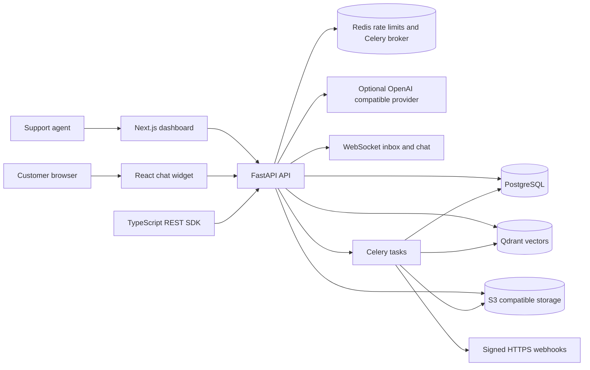

# OpenSupport: project and portfolio guide

## What the project is

OpenSupport is a self-hosted customer support platform. A business can create a workspace and projects, add approved support material, embed a chat widget on an allowed website, answer common questions with source-grounded AI, and hand conversations to human agents. It also includes an admin dashboard, asynchronous knowledge ingestion, API keys, integrations, signed webhooks, analytics, and organization data controls.

This is a portfolio-ready full-stack project. Its core engineering problem is coordinating public customer chat with private, multi-organization support data while keeping knowledge grounded, long-running ingestion asynchronous, and agent handoff usable.

## User experience, end to end

1. An owner creates an organization and signs in to the dashboard.
2. The owner creates a support project and allowlists the storefront's exact host.
3. The team adds FAQ text, public help pages, or PDF documents.
4. A customer opens the embedded widget. The API checks the project's allowed origin and creates a persisted conversation.
5. The assistant searches the project's approved FAQ and indexed chunks. If configured, an OpenAI compatible provider writes a concise answer using retrieved content. If it cannot find a relevant source or the customer asks for a person, the conversation escalates.
6. Agents use the authenticated inbox to claim, reply to, resolve, and reopen conversations. WebSocket updates keep the inbox and widget in sync.
7. Trusted backend integrations can use organization API keys. Webhook consumers receive signed events and can deduplicate them with the stable delivery ID.

## Architecture

### Technology choices

| Area | Technology | Purpose |
|---|---|---|
| API | Python, FastAPI, Pydantic | REST endpoints, validation, auth dependencies, OpenAPI docs |
| Relational data | PostgreSQL, SQLAlchemy async, Alembic | Organizations, roles, projects, conversations, messages, knowledge, audit and delivery records |
| Background jobs | Celery and Redis | Website/PDF ingestion and webhook delivery retries |
| Retrieval | Qdrant plus PostgreSQL fallback | Tenant-filtered semantic search, with lexical retrieval when embeddings are disabled |
| File storage | S3 compatible API / RustFS locally | Uploaded PDF storage |
| Dashboard | Next.js, React, TypeScript | Workspace setup, knowledge sources, agent inbox and developer tools |
| Widget | React, Vite, TypeScript | Embeddable customer chat and local playground |
| SDK | TypeScript workspace package | Server-side API client and shared contract types |
| Local infrastructure | Docker Compose | Reproducible database, cache, vector store, object store, and worker |

## Main code map

| Path | Responsibility |
|---|---|
| `backend/app/main.py` | FastAPI app, development schema bootstrap, middleware, health endpoint, WebSocket auth |
| `backend/app/api/auth.py` | Registration, login, refresh/logout, organization members, API keys, retention and export |
| `backend/app/api/routes.py` | Projects, knowledge, integrations, webhooks, widget chat, analytics, inbox and agent actions |
| `backend/app/models.py` | SQLAlchemy data model |
| `backend/app/schemas.py` | Pydantic input/output contracts |
| `backend/app/core/security.py` | Password hashing, access/refresh JWTs, signed widget identities, API key authentication |
| `backend/app/services/assistant.py` | Retrieval and source-grounded response flow |
| `backend/app/services/providers.py` | Built-in OpenAI-compatible provider and plugin entry point interface |
| `backend/app/services/ingestion.py` | URL safety checks, HTML/PDF extraction, chunking, source refresh |
| `backend/app/services/vector_store.py` | Embeddings, Qdrant filters, lexical fallback, vector deletion |
| `backend/app/services/webhooks.py` | Organization-scoped webhook event matching and persisted delivery enqueueing |
| `backend/app/services/webhook_delivery.py` | HTTPS delivery, HMAC signature, attempt tracking and retry timing |
| `backend/app/workers/` | Celery tasks and periodic webhook delivery recovery |
| `backend/alembic/` | Schema adoption and migration environment |
| `apps/dashboard/app/` | Dashboard, login, knowledge source management, agent inbox, developer settings |
| `apps/widget/src/` | Customer widget and preview app |
| `apps/demo-store/app/` | Example storefront with widget integration |
| `packages/sdk/` | TypeScript server-side API client |
| `packages/shared-types/` | Shared TypeScript types |

## Data and request flows

### Knowledge ingestion and answer retrieval

The API creates a source record before queueing a Celery task. The worker validates public URLs, avoids redirects, applies a configured byte limit, extracts HTML or PDF text, and splits it into overlapping chunks. PostgreSQL is the canonical source for chunk text. If an embedding provider and Qdrant are configured, the worker also stores vectors with organization and project identifiers in their payload. Search filters by both identifiers and verifies vector results against PostgreSQL. Without embeddings, search falls back to tenant-scoped lexical matching.

Refresh builds and indexes new chunks before replacing the old chunk set, so a failed refresh does not immediately discard the last successful content. Uploaded PDFs live in S3-compatible object storage.

### Conversation and handoff

Every conversation belongs to a project, and every project belongs to an organization. Authenticated inbox queries join through the project to scope access. The API persists customer, assistant, system, and agent messages. Explicit human requests, account-specific requests, repeated dissatisfaction, missing source content, and provider failures can lead to escalation. Agents operate as authenticated workspace users; their display name comes from the account.

### Authentication and tenant boundaries

- Passwords are stored as salted PBKDF2 hashes.
- Dashboard access and refresh tokens are signed JWTs; logout increments a token version to revoke existing tokens.
- API keys are high-entropy random values, stored as SHA-256 hashes, expire, can be revoked, and inherit the creating user's role.
- Widget requests must have an Origin matching one of the project's configured hosts.
- Optional customer identity tokens are signed server-side and bound to a project and expiry.
- Integration credentials and webhook signing secrets are encrypted with AES-GCM; webhook keys are shown once.
- URL ingestion and webhook targets reject private addresses. Webhook redirects are disabled and requests carry HMAC-SHA256 signatures.
- Redis applies coarse IP based limits to widget traffic and credential endpoints.
- Audit, export, analytics, retention, source, integration, and webhook operations are organization scoped.

## APIs and extension points

The API's interactive route catalogue is exposed at `/docs` when the app runs.

| Capability | Route family |
|---|---|
| Authentication | `/api/auth/*` |
| Projects and knowledge | `/api/projects/*` |
| Members, API keys, retention and export | `/api/organization/*` |
| Customer widget conversations and order lookup | `/api/widget/*` |
| Agent inbox and actions | `/api/agents/*` |
| Integrations | `/api/projects/{project_id}/integrations` |
| Webhook registration and delivery logs | `/api/webhooks/*` |
| Analytics and audit | `/api/analytics/*`, `/api/audit/*` |

Chat completion providers can be installed as Python `opensupport.providers` entry points. Each factory receives application settings and returns an object that implements `async complete(system_prompt, user_prompt) -> str`. The TypeScript SDK is intended for trusted server-side use; an API key must never be bundled into browser code.

## Local setup and testing

Use [Run and test OpenSupport locally](LOCAL_DEVELOPMENT.md) for copy-paste commands, a working widget walkthrough, tests, Docker logs, and troubleshooting. The required CI checks are pytest, Ruff, TypeScript typecheck, and production builds.

## What this project demonstrates

- Designing relational ownership boundaries and tenant-scoped data access.
- Building async REST and WebSocket flows across customer and agent surfaces.
- Combining semantic retrieval with a database-backed fallback and source citations.
- Using background jobs for bounded file/web ingestion and retriable external deliveries.
- Handling credentials through password hashing, signed tokens, hashed API keys, and encrypted integration secrets.
- Applying SSRF defenses to outbound fetch targets and validating widget origins.
- Creating a reusable monorepo SDK and a local infrastructure stack.
- Keeping deploy-time schema changes in Alembic and providing CI plus contributor documentation.

## Tradeoffs and known limits

- WebSocket fanout and agent presence are held in API process memory. Use one API instance for live updates, or add a shared Redis Pub/Sub adapter and routing strategy before horizontal scaling.
- Refresh tokens are currently stored in browser local storage. A production browser deployment should move refresh credentials to secure, HTTP-only cookies and add a stricter Content Security Policy.
- API keys inherit the creating account's role rather than a fine-grained permission scope. A future change should add explicit read/write scopes and project restrictions.
- Website freshness is refreshed on demand. A scheduled source refresh policy needs an operational cadence and content-change detection.
- The initial Alembic migration adopts local MVP schemas and is intentionally irreversible. Production upgrades should be backed up and rolled forward.
- The automated backend suite is focused on pure security/schema logic. Full multi-service integration tests should run against ephemeral PostgreSQL, Redis, Qdrant, and RustFS services in CI.

## Resume-ready project description

### One-line version

Built OpenSupport, a self-hosted multi-tenant customer support platform with a grounded AI chat widget, real-time agent handoff, asynchronous knowledge ingestion, and secure developer APIs.

### Resume bullets

- Built a multi-tenant FastAPI and PostgreSQL support platform with organization-scoped role checks across projects, conversations, knowledge, analytics, audits, and exports.
- Implemented source-grounded support responses using FAQ retrieval, PDF and website ingestion, Celery workers, Qdrant embeddings, and a PostgreSQL lexical fallback.
- Delivered a React chat widget and Next.js agent dashboard with authenticated WebSocket conversations, escalation, assignment, agent replies, and resolution flows.
- Added API key and webhook management with hashed credentials, encrypted signing secrets, HMAC verification, delivery history, and retry recovery.
- Packaged a TypeScript API SDK, Docker Compose development stack, Alembic migrations, CI checks, and contributor/runbook documentation.

Choose bullets that match what you can explain and demonstrate. Do not state traffic, latency, accuracy, or customer adoption metrics unless you measured them.

### Portfolio project card

**OpenSupport — Self-hosted AI support platform**  
FastAPI · PostgreSQL · SQLAlchemy · Celery · Redis · Qdrant · S3/RustFS · Next.js · React · TypeScript · Docker

Built an open-source customer support app that answers from a team's approved content and escalates uncertain or account-specific requests to agents. Includes multi-tenant workspaces, live inbox messaging, PDF/site ingestion, an embeddable widget, API keys, signed webhooks, and a TypeScript SDK.

### Interview walkthrough

Start with the product flow: a team allowlists a site and adds trusted support content; the widget sends an origin-checked message; retrieval returns only that project's material; unsupported questions go to a human. Then explain the tenant boundary (organization ownership and scoped queries), why ingestion and webhook delivery run asynchronously, how Qdrant results are checked against PostgreSQL, and which deployment limits remain. Finish by demoing an FAQ answer, a handoff, and webhook/API key management.

### Demo recording outline

1. Show organization registration and a newly created project.
2. Add an allowed host and one FAQ answer.
3. Ask the widget a matching question and show its cited source.
4. Ask for a human, reply from the agent inbox, and resolve the conversation.
5. Show a PDF/source indexing status, then show the developer tools and explain API key/webhook secret handling.

Capture a clean browser session with demo data only. Do not show actual customer data, production credentials, signing secrets, or `.env` values.
